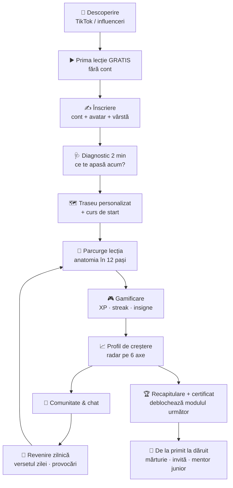

<callout icon="🎓" color="blue_bg">
	**Ce e documentul ăsta:** traseul complet și detaliat pentru o singură categorie — **Adolescenți (12–18)** — dus la nivel de platformă serioasă de learning. E **modelul** după care replicăm apoi restul categoriilor. Aici vezi: module → cursuri → lecții, plus cum arată o lecție „pe bune”, gamificarea, comunitatea și personalizarea.
</callout>
<callout icon="🧭" color="gray_bg">
	**Filozofia:** nu predăm religie, **însoțim un om real prin viață**. Fiecare lecție pleacă dintr-o luptă/întrebare reală → aduce Cuvântul → arată adevărul → arată **cum ajută Dumnezeu concret** → dă un pas mic. Adevărul e același; se schimbă doar limbajul.
</callout>
---
## Cum funcționează traseul
<callout icon="🩺" color="purple_bg">
	**1. Diagnostic la intrare (2 min).** Un mini-chestionar cald: „Ce te apasă cel mai mult acum?” (comparație, frică, singurătate, familie, îndoieli, curăție…). Pe baza răspunsului, platforma **recomandă cursul de start** și un traseu personalizat — nu arunci adolescentul într-un meniu gol.
</callout>
<callout icon="🧩" color="purple_bg">
	**2. Traseu personalizat + libertate.** Are un drum recomandat, dar poate oricând să sară la un curs de care are nevoie azi („azi mă cert cu ai mei” → cursul de familie).
</callout>
<callout icon="💬" color="purple_bg">
	**3. Chat „Întreabă orice”.** În orice lecție poate întreba liber („dar dacă eu nu simt nimic când mă rog?”) și primește un răspuns cald, biblic, pe vârsta lui.
</callout>
<callout icon="🔁" color="purple_bg">
	**4. Ritm + revenire.** Notificare zilnică blândă, streak, „versetul zilei”, și recapitulare la finalul fiecărui modul.
</callout>
---
## 🚀 Călătoria completă a adolescentului (cap-coadă)
<callout icon="🧭" color="blue_bg">
	Așa arată tot drumul, din secunda în care vede un clip pe TikTok până devine el însuși un om care dăruiește mai departe. Fiecare pas reduce fricțiunea și crește sensul.
</callout>

### 1. 📱 Descoperire (unde începe, de fapt)
- Un clip scurt (o luptă reală: „te simți nu-destul-de-bun?”) → în bio: *„Prima lecție, gratis, fără cont.”*
- Aterizează direct pe o lecție, nu pe o pagină de vânzare.
### 2. ▶️ Prima lecție fără fricțiune
- Primește valoare în primele 30 de secunde, **fără cont**. Simte formatul (chat cald, o idee pe bulă).
- La final: *„Vrei să continui de unde ai rămas? Îți salvez progresul.”* → abia acum cere cont.
### 3. ✍️ Înscriere & onboarding

Ce se întâmplă la înscriere

	- **Cont simplu:** Google / telefon / email.
	- **Alege un avatar + nume** (poate rămâne anonim — contează la temele sensibile).
	- **Vârsta** → deblochează traseul potrivit și stabilește ce module „mature” (M6) sunt disponibile.
	- **Permisiuni blânde:** notificări (versetul zilei); opțional, legătura cu un părinte.
	- **Promisiune clară:** „5–7 minute pe zi. Fără predici lungi. Doar tu, viața ta reală și Dumnezeu.”

### 4. 🩺 Diagnostic (2 minute)
- „Ce te apasă cel mai mult acum?” (comparație, frică, singurătate, familie, îndoieli, curăție…).
- Rezultatul: **cursul de start recomandat** + traseu personalizat + prima valoare pe radarul de creștere (baseline).
### 5. 🗺️ Traseul personalizat
- Dashboard „Parcursul meu”: buton mare **Continuă**, harta modulelor, streak, versetul zilei.
- Drum recomandat, dar cu libertate: „azi mă cert cu ai mei” → sare la cursul de familie.
### 6. 📖 Parcurgerea lecției
- Fiecare lecție rulează **anatomia în 12 pași** (vezi mai jos).
- La final: pas de azi + reflecție în jurnal + streak → pregătește revenirea de mâine.
### 7. 🎮 Gamificare + 📈 creștere
- Pe parcurs: XP, streak, insigne — și, mai important, **radarul de creștere** se extinde (vezi „Parcurs & progres”).
### 8. 👥 Comunitate & revenire
- Poate întreba orice în chat, poate intra într-un grup mic moderat, primește provocări săptămânale.
- Notificări blânde, personalizate după cum s-a simțit la ultimul check-in.
### 9. 🏆 Absolvire de modul
- Recapitulare + quiz + **certificat** + insignă → se deblochează modulul următor.
### 10. 🌱 De la primit la dăruit
- Invită prieteni, lasă o mărturie, iar cei constanți pot deveni **„mentor junior”** într-un grup — bucla care transformă un consumator într-un ucenic care face ucenici.
---
## 🧱 Anatomia unei lecții (așa e construită fiecare)

Vezi structura completă a unei lecții (12 pași)

	1. **Check-in emoțional** — „Cum ești azi, sincer?” (emoji/scală). Creează obicei + date pentru personalizare.
	2. **Cârligul (viața reală)** — o întrebare/scenă în care se recunoaște imediat.
	3. **Alegere** — 2–4 opțiuni; lecția se ramifică ușor după răspuns.
	4. **Lupta numită** — punem în cuvinte ce simte + minciuna din spate.
	5. **Ce zice lumea vs. ce e adevărat** — arătăm alternativele false (și de ce nu țin).
	6. **Cuvântul** — 1–3 versete cheie, în format clar, memorabil.
	7. **Adevărul explicat simplu** — fără limbaj bisericesc; exemple din viața lor.
	8. **Interacțiune / mini-quiz** — verifică înțelegerea, dă un badge.
	9. **Cum ajută Dumnezeu concret** — trecerea de la „știu” la „trăiesc”.
	10. **Pas de azi (relație, nu regulă)** — o acțiune mică, realizabilă azi.
	11. **Verset de memorat + rugăciune scurtă** — model, cu opțiunea „scrie tu”.
	12. **Reflecție în jurnal + streak/insignă** — închide bucla, pregătește revenirea.

<callout icon="📖" color="yellow_bg">
	**Exemplu deja scris integral:** lecția *„Nu sunt de ajuns”* (din Modulul 1) o ai ca demo separat — arată exact cum se simte anatomia asta în practică.
</callout>
---
## 🗺️ Harta traseului — 6 module
<table fit-page-width="true" header-row="true">
<tr>
<td>**Modul**</td>
<td>**Despre**</td>
<td>**Cursuri**</td>
</tr>
<tr>
<td>1. 🪞 Identitate & valoare</td>
<td>Cine sunt și cât valorez</td>
<td>3</td>
</tr>
<tr>
<td>2. 🧠 Emoții & sănătate mintală</td>
<td>Anxietate, frică, singurătate, tristețe</td>
<td>4</td>
</tr>
<tr>
<td>3. ❤️ Relații</td>
<td>Familie, prieteni, iubire, online</td>
<td>5</td>
</tr>
<tr>
<td>4. ✝️ Credință & îndoieli</td>
<td>Dumnezeu, Isus, Biblia, rugăciunea</td>
<td>4</td>
</tr>
<tr>
<td>5. 🎯 Caracter & scop</td>
<td>Cine devin, decizii, chemare</td>
<td>4</td>
</tr>
<tr>
<td>6. 🔒 Lupte tăcute</td>
<td>Curăție, dependențe, furie, invidie</td>
<td>4</td>
</tr>
</table>
<callout icon="📊" color="gray_bg">
	**Total:** 24 de cursuri · \~120 de lecții · \~12–14 ore de conținut pentru traseul complet al adolescenților.
</callout>
---
## 🔬 Harta, pusă față în față cu realitatea (adolescenți din România)
<callout icon="🧭" color="blue_bg">
	**Principiul de mapare:** datele de mai jos ne spun **unde doare** — punctul din care pleacă fiecare lecție (cârligul real). Dar **nu realitatea lor stabilește adevărul.** Durerea e reală; interpretarea („nu valorez”, „sunt singur pe veci”, „așa fac toți”) e adesea distorsionată. Emanus pornește de la realitatea măsurată → și o **pliază după Cuvânt**, care e adevărul și destinația. Nu validăm imaginea distorsionată; o aducem în lumina Scripturii.
</callout>
<table fit-page-width="true" header-row="true">
<tr>
<td>**Modul**</td>
<td>**Realitatea documentată în România**</td>
<td>**Ancora din Cuvânt (adevărul spre care pliem)**</td>
</tr>
<tr>
<td>1. 🪞 Identitate & valoare</td>
<td>România e **#1 în Europa** la uz problematic de social media (**22%** dintre adolescenți); **53%** simt că au o problemă cu timpul pe rețele; valoarea măsurată în like-uri și comparație.</td>
<td>Valoarea vine de la Creator, nu din performanță sau aprecieri (Ps 139:14; Gen 1:27; Ioan 1:12).</td>
</tr>
<tr>
<td>2. 🧠 Emoții & sănătate mintală</td>
<td>**1 din 2** tineri spun că au trecut prin depresie/anxietate; **46%** dintre cei afectați sunt Gen Z; **61% NU cer ajutor** (rușine, frica de a fi judecați); jumătate din tulburări apar până la 14 ani.</td>
<td>Pacea care întrece priceperea (Filip 4:6-7); Ilie — obosit, nu părăsit (1 Împ 19). A cere ajutor nu e slăbiciune, ci curaj.</td>
</tr>
<tr>
<td>3. ❤️ Relații</td>
<td>**\~49%** dintre elevi au fost victime ale bullying-ului, **82%** au fost martori; familii destrămate; viața socială mutată online.</td>
<td>Iubirea reală (1 Cor 13); cinstirea părinților chiar când e greu (Efes 6:1-3); valoarea mea n-o dau cuvintele lor.</td>
</tr>
<tr>
<td>4. ✝️ Credință & îndoieli</td>
<td>**95%** cred în Dumnezeu, dar doar **\~33%** practicanți și **21%** merg la biserică — credință moștenită, rar internalizată; multe îndoieli nespuse.</td>
<td>De la „știu despre Dumnezeu” la „Îl cunosc”; îndoiala dusă până la capăt întărește credința (Toma, Ioan 20).</td>
</tr>
<tr>
<td>5. 🎯 Caracter & scop</td>
<td>**68%** dintre tineri cred că țara merge greșit, **2 din 3** s-au gândit să plece; **\~19%** nu sunt nici la școală, nici la muncă (NEET) — criză de direcție și sens.</td>
<td>Suntem lucrarea Lui, făcuți pentru fapte bune (Efes 2:10); chemare și rost dincolo de circumstanțe.</td>
</tr>
<tr>
<td>6. 🔒 Lupte tăcute</td>
<td>Peste **jumătate** dintre copiii de 11–13 ani au văzut pornografie; **48%** dintre băieți au debut sexual sub 15 ani; ecrane **6h+/zi**; **\~50%** au avut măcar o dată gânduri de suicid, iar rata suicidului sub 15 ani e **dublă** față de media UE.</td>
<td>Libertate prin har, nu prin rușine; curăție și demnitate (1 Cor 6:19-20); nu lupți singur. La teme grele: **resurse de urgență vizibile**.</td>
</tr>
</table>
<callout icon="✅" color="green_bg">
	**Verdict: maparea se pliază.** Toate cele 6 module corespund unor realități **documentate și larg răspândite** la adolescenții români — nu unor teme inventate. Structura ține.
</callout>
<callout icon="🔧" color="yellow_bg">
	**Ajustări cerute de date (ca să fie „necesar”, nu doar frumos):**
	- **Ridică prioritatea Modulului 2 (sănătate mintală)** și a temelor „ecrane/comparație” din M1 și M6 — acolo România stă cel mai rău din Europa.
	- **Pune resurse de criză la vedere** (Telefonul Copilului 116 111, 112) în tot Modulul 2 și în M6, nu doar într-o lecție.
	- **Tratează „a cere ajutor” ca temă transversală** — 61% nu cer ajutor, deci fiecare modul greu trebuie să spargă rușinea.
	- **Modulul 4 (credință) e mai urgent decât pare:** mulți „cred”, puțini au o relație vie — accentul cade pe *internalizare*, nu pe informație.
</callout>
<callout icon="📚" color="gray_bg">
	**Surse (2024–2025):** [Depresie/anxietate Gen Z – HotNews](https://hotnews.ro/studiu-unul-din-doi-adolescenti-sau-tineri-din-romania-spune-ca-s-a-confruntat-cu-depresia-sau-anxietatea-in-ultimele-luni-1984706) · [Social media #1 în Europa – Radio România/OMS](https://www.radioromania.ro/Actualitate/adolescentii-romani-pe-primul-loc-la-folosirea-problematica-a-social-media-id44414.html) · [Dependență digitală 53% – Edupedu](https://www.edupedu.ro/jumatate-dintre-elevii-din-romania-sunt-in-risc-de-dependenta-digitala-fetele-de-social-media-baietii-de-gaming-opt-din-zece-adolescenti-consuma-alcool-raport-european/) · [Bullying 49%/82% – Salvați Copiii](https://www.salvaticopiii.ro/sites/ro/files/2023-11/studiu-peste-un-sfert-dintre-copii-au-fost-agresori-jumatate-spun-ca-au-fost-victime-ale-bullying-ului.pdf) · [Gânduri de suicid \~50% – Știrile ProTV](https://stirileprotv.ro/my-impact/aproape-50-dintre-adolescentii-romani-s-au-gandit-la-sinucidere-zeste-a-doua-cauza-de-moarte-dupa-accidente.html) · [Pornografie 11–13 ani – Școala9](https://scoala9.ro/mai-mult-de-jumatate-dintre-copiii-intre-11-si-13-ani-au-vizionat/1149) · [Debut sexual OMS – Digi24](https://www.digi24.ro/stiri/actualitate/social/studiu-oms-48-dintre-baietii-din-romania-au-prima-experienta-sexuala-pana-la-15-ani-221741) · [Credință 95%/33% – Digi24](https://www.digi24.ro/stiri/actualitate/social/romanii-si-religia-95-cred-in-dumnezeu-21-merg-la-biserica-918855) · [Tineri: direcție/NEET – IRES](https://ires.ro/articol/455/tinerii-romani-in-anul-electoral-2024---raportul-complet)
</callout>
---
## Modulul 1 — 🪞 Identitate & valoare
### 1.1 Cine sunt eu, de fapt? *(curs de start · 6 lecții)*
<callout icon="🎯" color="gray_bg">
	**Lupta:** „nu știu cine sunt / mă definesc după like-uri, note, ce zic alții.” **Adevărul:** identitatea și valoarea vin de la Creator, nu din performanță.
</callout>

Lecțiile (cu anatomia completă)

	**L1 — Nu ești ce zic like-urile**
	- *Cârlig:* câte story-uri ștergi dacă nu iau destule aprecieri?
	- *Cuvântul:* Geneza 1:27 (după chipul lui Dumnezeu).
	- *Verset de memorat:* Psalm 139:14.
	- *Pas:* o zi fără să verifici aprecierile la o postare.
	**L2 — Nu sunt de ajuns** *(lecție-pilot deja scrisă)*
	- Valoarea nu se câștigă prin performanță; ești copil iubit (Ioan 1:12, Romani 5:8).
	**L3 — Capcana comparației**
	- 2 Corinteni 10:12 (cine se compară e fără pricepere); de ce social media ne fură pacea.
	**L4 — Oglinda: cum mă văd pe mine**
	- Imagine corporală, nemulțumire; trupul ca „templu” (1 Cor 6:19-20), demnitate.
	**L5 — Pentru ce exist?**
	- Scop și rost; Efeseni 2:10 (suntem lucrarea Lui, făcuți pentru fapte bune).
	**L6 — Al cui sunt — și de ce schimbă tot**
	- Apartenența la Dumnezeu ca temelie; Isaia 43:1 („ești al Meu”). Recapitulare + insignă de modul.

### 1.2 Masca și omul adevărat *(5 lecții)*

Lecțiile

	1. De ce port mască (frica de respingere)
	2. Perfecționismul care obosește
	3. Curajul de a fi vulnerabil
	4. Prietenii în fața cărora pot fi eu
	5. Dumnezeu mă vede tot — și tot mă iubește

### 1.3 Rușinea și vina *(5 lecții)*

Lecțiile

	1. Vină („am greșit”) vs. rușine („sunt o greșeală”)
	2. Ce fac cu trecutul care mă apasă
	3. Iertarea lui Dumnezeu (1 Ioan 1:9)
	4. Să mă iert pe mine
	5. Un nou început — identitate nouă (2 Cor 5:17)

---
## Modulul 2 — 🧠 Emoții & sănătate mintală
<callout icon="⚠️" color="orange_bg">
	**Cu grijă:** aceste cursuri normalizează și **încurajează ajutorul specializat** (părinte, consilier, terapeut, linie de urgență) alături de credință. Emanus **completează**, nu înlocuiește ajutorul profesionist. La teme grele (depresie, gânduri de autovătămare) afișăm resurse de urgență.
</callout>
### 2.1 Presiune, anxietate și pace *(6 lecții)*

Lecțiile

	1. De ce mă simt copleșit
	2. Anxietatea: ce e și ce NU e păcat
	3. Îngrijorarea vs. încrederea (Matei 6:25-34)
	4. Când vine valul (panică/gânduri negre) — pași practici + prezența lui Dumnezeu
	5. Pacea care întrece priceperea (Filipeni 4:6-7)
	6. Când am nevoie de ajutor — și de ce nu e o rușine

### 2.2 Frica de viitor *(5 lecții)*

Lecțiile

	1. Necunoscutul mă sperie
	2. Alegeri mari (facultate, carieră) fără panică
	3. Ce controlez și ce las în mâna lui Dumnezeu
	4. Planurile Lui (Ieremia 29:11 — în context corect)
	5. Un pas azi, nu tot drumul deodată

### 2.3 Singurătatea *(5 lecții)*

Lecțiile

	1. Pot fi singur și în mijlocul oamenilor
	2. Respingerea și rana ei
	3. Cum construiesc prietenii reale
	4. Comunitatea — de ce am nevoie de ceilalți
	5. Dumnezeu, mereu prezent (Deut 31:6)

### 2.4 Tristețea și depresia *(5 lecții)*

Lecțiile

	1. Ce e depresia (și ce nu e)
	2. Psalmii de plâns — e ok să-I spui lui Dumnezeu că doare
	3. Ilie sub copac: obosit, nu părăsit (1 Împ 19)
	4. Speranța când nu simt nimic
	5. Nu ești singur — cere ajutor (resurse + oameni)

---
## Modulul 3 — ❤️ Relații
### 3.1 Familia mea (și când e complicat) *(5 lecții)*

Lecțiile

	1. Cinstește-i pe părinți — chiar când e greu (Efes 6:1-3)
	2. Conflictele: cum vorbesc fără să explodez
	3. Când familia e destrămată (divorț, absență)
	4. Fratele/sora care mă calcă pe nervi
	5. Iertarea în familie

### 3.2 Prietenii care contează *(5 lecții)*

Lecțiile

	1. Cum îmi aleg anturajul (1 Cor 15:33)
	2. Presiunea grupului
	3. Când un prieten mă trădează
	4. Loialitate și adevăr spus cu iubire
	5. Să fiu eu prietenul bun

### 3.3 Bullying și răutatea *(4 lecții)*

Lecțiile

	1. Când eu sunt ținta
	2. Când văd pe altcineva umilit (curajul martorului)
	3. Iertare, dar și limite sănătoase
	4. Valoarea mea nu o dau cuvintele lor

### 3.4 Iubire, relații și curăție *(6 lecții)*

Lecțiile

	1. Atracție vs. iubire reală
	2. Ce înseamnă să iubești cu adevărat (1 Cor 13)
	3. Limite sănătoase și de ce contează
	4. Sexul, așteptarea și demnitatea (fără rușinare)
	5. Despărțiri și inimă rănită
	6. Păzește-ți inima (Prov 4:23)

### 3.5 Viața online *(5 lecții)*

Lecțiile

	1. Cine sunt eu online vs. offline
	2. Comparația care fură bucuria
	3. Timpul, scrollul și dependența
	4. Ce postez și ce las în urmă (amprenta digitală)
	5. Cyberbullying și cum reacționez

---
## Modulul 4 — ✝️ Credință & îndoieli
### 4.1 Pot să cred cu adevărat? *(curs-cheie · 6 lecții)*
<callout icon="🎯" color="gray_bg">
	**Lupta:** „am îndoieli, mi-e frică să întreb la biserică.” **Adevărul:** îndoiala nu e dușmanul credinței; întrebările duse până la capăt o întăresc.
</callout>

Lecțiile

	1. E normal să am îndoieli (Toma)
	2. Există Dumnezeu? (argumente pe înțelesul lor)
	3. Știința și credința — chiar se bat?
	4. Pot avea încredere în Biblie?
	5. Dacă Dumnezeu e bun, de ce există suferință?
	6. De la „știu despre Dumnezeu” la „Îl cunosc”

### 4.2 Cine e Isus, de fapt? *(5 lecții)*

Lecțiile

	1. Omul care a schimbat istoria
	2. Minunile — ce arătau de fapt
	3. Crucea: de ce a murit pentru mine
	4. Învierea: dovada și diferența
	5. Ce înseamnă să-L urmez azi

### 4.3 Rugăciunea reală *(5 lecții)*

Lecțiile

	1. Ce e rugăciunea (nu o formulă magică)
	2. Cum mă rog, practic
	3. Când nu primesc răspuns
	4. Să și ascult, nu doar să cer
	5. Jurnalul de rugăciune

### 4.4 Biblia fără plictiseală *(5 lecții)*

Lecțiile

	1. Ce e Biblia, de fapt
	2. Cum o citesc fără să mă pierd
	3. Cum înțeleg ce citesc
	4. Cum o aplic în viața mea
	5. Planul zilnic de 5 minute

---
## Modulul 5 — 🎯 Caracter & scop
### 5.1 Cine vreau să devin *(5 lecții)*

Lecțiile

	1. Caracterul se vede când nu mă vede nimeni
	2. Valorile mele — după ce iau decizii
	3. Obiceiuri care mă construiesc
	4. Curajul de a fi diferit
	5. Cine vreau să fiu peste 10 ani

### 5.2 Bani, muncă și rost *(4 lecții)*

Lecțiile

	1. Primul job și banii mei
	2. Banii: unealtă, nu stăpân (Matei 6:24)
	3. Generozitatea care schimbă inima
	4. Muncă cu sens, nu doar pentru salariu

### 5.3 Timpul și prioritățile *(4 lecții)*

Lecțiile

	1. Unde-mi curge timpul (telefon, scroll)
	2. Procrastinarea și frica din spate
	3. Focus: mai puțin, dar mai bine
	4. Dumnezeu pe primul loc, restul se așază

### 5.4 Chemarea mea *(5 lecții)*

Lecțiile

	1. Talentele mele nu-s întâmplătoare
	2. Visurile și Dumnezeu
	3. Cum descopăr ce vrea El de la mine
	4. Să slujesc de pe acum, de la vârsta mea
	5. Curajul primului pas

---
## Modulul 6 — 🔒 Lupte tăcute
<callout icon="🔐" color="orange_bg">
	**Traseu „matur”, cu tact.** Fără rușinare, fără detalii inutile — doar adevăr, har și pași concreți. Deblocabil de la o anumită vârstă / cu profil setat. Accent pe **libertate**, nu pe vinovăție.
</callout>
### 6.1 Libertate: pornografie și curăție *(5 lecții)*

Lecțiile

	1. Ce se întâmplă de fapt (creier, dopamină) — fără dramatizare
	2. Rușinea ține în lanț; harul eliberează
	3. Pași practici (declanșatori, filtre, obiceiuri)
	4. Responsabilitate: nu lupt singur
	5. O identitate nouă, o zi la un moment dat

### 6.2 Dependența de telefon și dopamina *(4 lecții)*

Lecțiile

	1. Cum îmi fură atenția (design-ul aplicațiilor)
	2. Semnele că mă controlează
	3. Detox și limite realiste
	4. Cu ce umplu golul

### 6.3 Furia și controlul *(4 lecții)*

Lecțiile

	1. De unde vine furia mea
	2. „Mâniați-vă și nu păcătuiți” (Efes 4:26)
	3. Pași când simt că explodez
	4. Iertarea care mă eliberează pe mine

### 6.4 Comparație și invidie *(4 lecții)*

Lecțiile

	1. De ce mă doare succesul altora
	2. Rădăcina: nesiguranța
	3. Recunoștința ca antidot
	4. Bucuria pentru celălalt

---
## 🎮 Sistemul de gamificare & progres
<callout icon="🔥" color="green_bg">
	**Streak zilnic** + „versetul zilei” · **XP și niveluri** (ex. „Ucenic → Căutător → Mărturisitor”) · **Insigne** pe curs/modul · **Certificat** la finalul unui modul.
</callout>
<callout icon="🗺️" color="green_bg">
	**Hartă de progres vizuală** (module deblocabile) · **recapitulări** la final de modul · **reamintiri** blânde prin notificare, personalizate după check-in-ul emoțional.
</callout>
---
## 📈 Parcurs, progres & creșterea personală
<callout icon="🎯" color="purple_bg">
	Măsurăm **două lucruri diferite**: **Activitatea** (ce face — prin gamificare: XP, streak, insigne) și **Creșterea** (cine devine — prin *Profilul de creștere*). Punctele motivează; creșterea reală e scopul.
</callout>
### 🕸️ Profilul de creștere (radar pe 6 axe)
<callout icon="🕸️" color="gray_bg">
	În aplicație apare ca un **grafic radar** (exact ca exemplul pe care l-ai trimis): 6 axe, iar forma se extinde pe măsură ce adolescentul crește. Îi arată vizual „unde am pornit → unde sunt acum”.
</callout>
<table fit-page-width="true" header-row="true">
<tr>
<td>**Axă (dimensiune)**</td>
<td>**Ce măsoară**</td>
<td>**Cum crește**</td>
</tr>
<tr>
<td>🪞 Identitate & valoare</td>
<td>Cât își sprijină valoarea pe Dumnezeu, nu pe like-uri/performanță</td>
<td>Modulul 1 + „pașii de azi” bifați + auto-evaluare</td>
</tr>
<tr>
<td>🧠 Pace & echilibru emoțional</td>
<td>Cum gestionează anxietatea, frica, tristețea</td>
<td>Modulul 2 + check-in emoțional zilnic</td>
</tr>
<tr>
<td>❤️ Relații sănătoase</td>
<td>Familie, prieteni, limite, iertare</td>
<td>Modulul 3 + provocări de grup</td>
</tr>
<tr>
<td>✝️ Credință vie</td>
<td>Relația reală cu Dumnezeu (rugăciune, Cuvânt), nu doar informația</td>
<td>Modulul 4 + streak de rugăciune/jurnal</td>
</tr>
<tr>
<td>🎯 Caracter & disciplină</td>
<td>Obiceiuri, decizii, scop, consecvență</td>
<td>Modulul 5 + streak-uri + consecvență</td>
</tr>
<tr>
<td>🔒 Libertate</td>
<td>Biruință în luptele tăcute, viață fără rușine</td>
<td>Modulul 6 + responsabilitate în grup</td>
</tr>
</table>
<callout icon="🔄" color="gray_bg">
	**Cum se actualizează radarul:** (1) **baseline** la diagnostic; (2) **re-evaluare** scurtă la finalul fiecărui modul; (3) **semnale reale** din comportament (streak, jurnal, quiz, „pasul de azi” bifat, check-in emoțional). Nu e o notă — e o oglindă a creșterii.
</callout>
### 📊 Dashboard-ul „Parcursul meu”
<callout icon="📊" color="blue_bg">
	Ce vede adolescentul când deschide aplicația:
	- 🔥 **Streak** + versetul zilei
	- ▶️ **Continuă** (următoarea lecție) + **% din cursul curent**
	- 🕸️ **Radarul de creștere** (unde am pornit → unde sunt)
	- 🏅 **Insigne & certificate** obținute
	- 📓 **Jurnalul** meu (reflecțiile mele, doar ale mele)
	- 🗺️ **Harta modulelor** (ce am deblocat / ce urmează)
</callout>
### 🎯 Îmbunătățirea personalității (cum se traduce în viața reală)
<callout icon="🌱" color="green_bg">
	Creșterea nu înseamnă puncte, ci **schimbare trăită**. Fiecare dimensiune are un „înainte” (minciuna) și un „după” (adevărul trăit).
</callout>
<table fit-page-width="true" header-row="true">
<tr>
<td>**Dimensiune**</td>
<td>**„Înainte” (minciuna)**</td>
<td>**„După” (adevărul trăit)**</td>
</tr>
<tr>
<td>Identitate</td>
<td>„Valorez cât primesc aprecieri.”</td>
<td>„Sunt iubit și valoros pentru că sunt al Lui.”</td>
</tr>
<tr>
<td>Emoții</td>
<td>„Dacă simt anxietate, ceva e în neregulă cu credința mea.”</td>
<td>„Îmi duc frica la Dumnezeu și cer ajutor — fără rușine.”</td>
</tr>
<tr>
<td>Relații</td>
<td>„Trebuie să mă prefac ca să fiu acceptat.”</td>
<td>„Pot fi eu, pun limite sănătoase și iert.”</td>
</tr>
<tr>
<td>Credință</td>
<td>„Știu despre Dumnezeu.”</td>
<td>„Îl cunosc și vorbesc cu El zilnic.”</td>
</tr>
<tr>
<td>Caracter</td>
<td>„Fac ce simt, când simt.”</td>
<td>„Am obiceiuri și decizii care mă construiesc.”</td>
</tr>
<tr>
<td>Libertate</td>
<td>„Sunt prizonierul rușinii mele.”</td>
<td>„Trăiesc în har, o zi la un moment dat, nu singur.”</td>
</tr>
</table>
---
## 👥 Comunitate & chat
<callout icon="💬" color="blue_bg">
	**Chat de învățare** (întreabă orice în lecție) + **chat uman** (grup mic pe traseu, moderat) · **cereri de rugăciune** anonime opționale · **provocări săptămânale** de grup (ex. „7 zile de recunoștință”).
</callout>
## 👪 Legătura cu părinții
<callout icon="🔗" color="gray_bg">
	Cursurile pentru adolescenți se leagă de traseul **Părinți** („Când copilul se îndepărtează de Dumnezeu”). Părintele poate primi (cu acordul adolescentului) teme de discuție acasă — fără să-i încalce intimitatea.
</callout>
---
## ▶️ Ordinea recomandată
1. **Diagnostic** → cursul de start recomandat.
2. **Modulul 1** (identitate) — temelia; fără ea, restul nu prinde.
3. Apoi **după nevoia reală** (Modulul 2 dacă e anxietate, 3 dacă sunt relațiile etc.).
4. **Modulul 4** (credință) în paralel, ca fir roșu.
5. Modulul 6 se deblochează când e cazul.
<callout icon="🚀" color="yellow_bg">
	**Pentru lansare (MVP):** produ complet doar **Cursul 1.1 „Cine sunt eu, de fapt?”** (6 lecții) + 2 lecții din Modulul 2. Le testezi pe TikTok, măsori retenția, apoi extinzi modul cu modul.
</callout>
---
## 🧩 Matricea reutilizabilă (șablon pentru orice categorie)
<callout icon="🧩" color="purple_bg">
	Dacă structura asta e perfectă pentru adolescenți, ea devine **matricea** după care construim celelalte 6 categorii. Se schimbă limbajul, formatul și exemplele — **NU** coloana vertebrală și nici ancora (Cuvântul).
</callout>
### Ce rămâne FIX vs. ce se ADAPTEAZĂ
<table fit-page-width="true" header-row="true">
<tr>
<td>**Element**</td>
<td>**Fix (ADN-ul Emanus)**</td>
<td>**Se adaptează per categorie**</td>
</tr>
<tr>
<td>Coloana vertebrală</td>
<td>Cele 6 module: identitate · emoții · relații · credință · caracter · lupte</td>
<td>Ce lupte sunt relevante + exemplele</td>
</tr>
<tr>
<td>Anatomia lecției</td>
<td>Traiectoria: luptă reală → Cuvânt → adevăr → cum ajută Dumnezeu → un pas</td>
<td>Lungimea și cei 12 pași (se scurtează pentru copii)</td>
</tr>
<tr>
<td>Onboarding + diagnostic</td>
<td>„Ce te apasă acum?” → traseu personalizat</td>
<td>Întrebările, vârsta, cine se înscrie (părinte pt. cei mici)</td>
</tr>
<tr>
<td>Formatul lecției</td>
<td>Conversație/chat, o idee pe bulă</td>
<td>Chat+video, animație+audio, text+reflecție, font mare+audio</td>
</tr>
<tr>
<td>Gamificare</td>
<td>XP · streak · insigne · certificat</td>
<td>Denumirile nivelurilor și temele</td>
</tr>
<tr>
<td>Profil de creștere (radar)</td>
<td>Cele 6 axe</td>
<td>Etichetele, pe limbajul vârstei</td>
</tr>
<tr>
<td>Comunitate & chat</td>
<td>Întreabă orice + grup mic + rugăciune</td>
<td>Nivelul de moderare și controlul parental</td>
</tr>
<tr>
<td>Ancora</td>
<td>Cuvântul e adevărul; realitatea se pliază după Biblie</td>
<td>Versetele alese pe vârstă</td>
</tr>
</table>
### Cele 7 categorii prin aceeași matrice
<table fit-page-width="true" header-row="true">
<tr>
<td>**Categorie**</td>
<td>**Format dominant**</td>
<td>**Cine parcurge**</td>
<td>**Accent**</td>
</tr>
<tr>
<td>Bebeluși & preșcolari (0–5)</td>
<td>Animație + audio</td>
<td>Părintele, cu copilul</td>
<td>Povești, cântece, primele valori</td>
</tr>
<tr>
<td>Copii (6–11)</td>
<td>Text simplu ± animație + quiz</td>
<td>Copilul + părinte</td>
<td>Identitate, prietenie, primul „da” pentru Dumnezeu</td>
</tr>
<tr>
<td>**Adolescenți (12–18)** ⭐</td>
<td>Chat + video</td>
<td>Adolescentul</td>
<td>Identitate, sănătate mintală, lupte — **categoria-model**</td>
</tr>
<tr>
<td>Adulți – femei</td>
<td>Chat + video + reflecție</td>
<td>Adultul</td>
<td>Identitate, relații, anxietate, rol</td>
</tr>
<tr>
<td>Adulți – bărbați</td>
<td>Chat + video + provocări</td>
<td>Adultul</td>
<td>Scop, curăție, responsabilitate, tărie</td>
</tr>
<tr>
<td>Părinți</td>
<td>Chat + ghiduri practice</td>
<td>Părintele</td>
<td>Cum crești copii în credință, „când se îndepărtează”</td>
</tr>
<tr>
<td>Bunici</td>
<td>Chat + audio, font mare</td>
<td>Seniorul</td>
<td>Sens la orice vârstă, singurătate, moștenire de credință</td>
</tr>
</table>
<callout icon="✅" color="green_bg">
	**Următorul pas logic:** validăm forma asta pe adolescenți (cursul 1.1 scris cap-coadă), apoi aplicăm matricea pe încă o categorie — recomand **Copii (6–11)** sau **Adulți**.
</callout>
