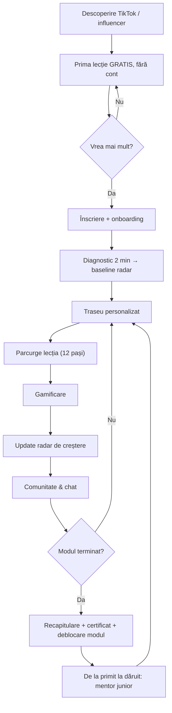

<callout icon="🛠️" color="blue_bg">
	**Ce este acest document.** Un brief tehnic complet, auto-suficient, pe care un agent de cod (ex. Codex) îl poate executa **fără să mai întrebe nimic**. Conține viziunea, regulile, matricea, **toate cele 7 categorii**, modelul de date, API-ul, ecranele, gamificarea, profilul de creștere și conținutul-sămânță aprobat. Dacă un detaliu lipsește, agentul alege opțiunea cea mai simplă, sigură, standard și o notează în `DECISIONS.md`.
</callout>
<callout icon="📌" color="gray_bg">
	**Surse canonice (conținut aprobat):** <mention-page url="https://app.notion.com/p/e78d513e66a04bde864b80a80e88b9ca"/> · <mention-page url="https://app.notion.com/p/384967206baa4e808d8b4b3055bac0c4"/> · <mention-page url="https://app.notion.com/p/872e99cf6b6c4d6582bf8889aa7769f9"/> · <mention-page url="https://app.notion.com/p/5d2c1b117ccd4db0a4225be2c4c99be0"/> · <mention-page url="https://app.notion.com/p/f73ff8e6cf6d4131a4196180df0668af"/>. În caz de conflict, **acest workbook** are prioritate pentru decizii de implementare.
</callout>
<callout icon="⚖️" color="yellow_bg">
	**Principiu non-negociabil:** Emanus e o platformă educațională creștină. **Cuvântul din Biblie = adevărul de referință.** Datele despre realitate arată *unde doare* (cârligul), dar identitatea și soluția se pliază după Scriptură, nu invers. Credința = relație vie cu Dumnezeu, nu reguli.
</callout>
## 🗂️ Cuprins
<table_of_contents/>
---
## 1 · Ce construim (rezumat de produs)
Emanus = platformă educațională creștină pentru toată familia: **micro-lecții în format chat interactiv**, pe **7 categorii de vârstă**, cu **gamificare**, un **profil de creștere personală (radar)** și o **comunitate** ușoară. Fiecare lecție: luptă reală → Cuvântul → adevărul → cum ajută Dumnezeu concret → un pas mic.
**Distribuție:** creator-led (TikTok @danielincredinta + influenceri creștini), **nu** prin biserici. Implicații de produs:
- **Prima lecție complet gratis, fără cont** (valoare în \<30s → invitație la înscriere).
- **Deep links** din bio/video direct într-o lecție sau categorie.
- **Referral / „pay-it-forward”** (un user plătește acces pentru altul).
**Venit:** freemium (conversie țintă 3–8%), donații/pay-it-forward, potențial export/licențiere.
---
## 2 · Cele 7 categorii (privire de ansamblu)
<table fit-page-width="true" header-row="true">
<tr>
<td>Cod</td>
<td>Categorie</td>
<td>Vârstă</td>
<td>Format dominant</td>
<td>Note UX</td>
</tr>
<tr>
<td>`kids0_5`</td>
<td>Bebeluși & preșcolari</td>
<td>0–5</td>
<td>Animație + audio, cu părintele</td>
<td>Fără text; controlat de părinte; 2–3 min</td>
</tr>
<tr>
<td>`kids6_11`</td>
<td>Copii</td>
<td>6–11</td>
<td>Text simplu ± animație + quiz</td>
<td>Bule scurte, ilustrații, recompense vizuale</td>
</tr>
<tr>
<td>`teens12_18`</td>
<td>Adolescenți ⭐</td>
<td>12–18</td>
<td>Chat interactiv + video</td>
<td>**Categoria-model, proiectată cap-coadă**</td>
</tr>
<tr>
<td>`women`</td>
<td>Adulți — femei</td>
<td>18+</td>
<td>Chat + video + reflecție</td>
<td>Identitate, relații, anxietate, rol</td>
</tr>
<tr>
<td>`men`</td>
<td>Adulți — bărbați</td>
<td>18+</td>
<td>Chat + video + reflecție</td>
<td>Scop, disciplină, integritate, tată</td>
</tr>
<tr>
<td>`parents`</td>
<td>Părinți</td>
<td>—</td>
<td>Chat + ghiduri practice</td>
<td>Legătură cu progresul copilului</td>
</tr>
<tr>
<td>`grandparents`</td>
<td>Bunici</td>
<td>—</td>
<td>Chat + audio, font mare</td>
<td>Text mare, contrast, audio-first</td>
</tr>
</table>
<callout icon="⭐" color="purple_bg">
	**Ordine de build:** întâi `teens12_18` complet (categoria-model, conținut seed în secț. 13). Apoi se replică prin matrice: `kids6_11` → `women` → `men` → `parents` → `grandparents` → `kids0_5`.
</callout>
---
## 3 · Modelul de conținut (ierarhie — FIX pentru toate categoriile)
```plain text
Category (7)
  └─ Module (≈ 6 module/categorie, aliniate pe 6 axe)
       └─ Course (≈ 4 cursuri/modul)
            └─ Lesson (≈ 5 lecții/curs, 5–7 min)
                 └─ LessonStep (cele 12 beat-uri din anatomie)
```
**Cele 6 axe/module (coloana vertebrală comună):** `identity`, `emotional_peace`, `relationships`, `living_faith`, `character`, `freedom`. Fiecare categorie definește aceste 6 module, dar cu **teme și ton adaptate vârstei** (vezi secț. 5). Aceleași 6 axe = axele profilului de creștere (radar, secț. 10).
---
## 4 · Matricea: ce rămâne FIX vs. ce se ADAPTEAZă
Nucleul reutilizabil. Codul tratează partea FIX ca **engine comun**, iar partea ADAPTABILĂ ca **date de config per categorie** (`CategoryConfig` — JSON), nu cod duplicat.
<table fit-page-width="true" header-row="true" header-column="true">
<tr>
<td>Element</td>
<td>FIX (ADN Emanus — engine)</td>
<td>ADAPTABIL (config per categorie)</td>
</tr>
<tr>
<td>Coloana vertebrală</td>
<td>Ierarhia Category→Module→Course→Lesson și cele 6 axe</td>
<td>Temele modulelor, câte cursuri/lecții</td>
</tr>
<tr>
<td>Anatomia lecției</td>
<td>Cele 12 beat-uri, în ordine fixă</td>
<td>Ton, lungime bule, exemple, vocabular</td>
</tr>
<tr>
<td>Onboarding + diagnostic</td>
<td>Flux + scoring baseline pe axe</td>
<td>Întrebările de diagnostic per vârstă</td>
</tr>
<tr>
<td>Format lecție</td>
<td>Player de chat cu pași tipiți</td>
<td>Mix chat/video/audio/animație</td>
</tr>
<tr>
<td>Gamificare</td>
<td>XP, streak, insigne, certificate</td>
<td>Denumiri, praguri, vizual</td>
</tr>
<tr>
<td>Profil de creștere (radar)</td>
<td>Motor 6 axe, baseline→reevaluare</td>
<td>Etichete axe, semnale măsurate</td>
</tr>
<tr>
<td>Comunitate</td>
<td>Postare/reacție/moderare</td>
<td>Reguli de vârstă, ce e permis</td>
</tr>
<tr>
<td>Ancora</td>
<td>**Biblia = adevărul** (invariant)</td>
<td>Traducerea/versetele selectate</td>
</tr>
</table>
<callout icon="💡" color="green_bg">
	**Regula de aur:** o singură bază de cod, comportament diferit prin `CategoryConfig`. A adăuga o categorie = conținut + un config, **nu** cod nou.
</callout>
---
## 5 · Curriculumul complet — toate cele 7 categorii
Fiecare categorie are 6 module (pe cele 6 axe), adaptate vârstei. Adolescenții sunt detaliați cap-coadă (+seed în secț. 13); pentru restul, mai jos e harta de module + exemple de cursuri, gata de populat cu lecții după același șablon.
### 5.1 🍼 Bebeluși & preșcolari (`kids0_5`) — animație+audio, cu părintele
<table fit-page-width="true" header-row="true">
<tr>
<td>#</td>
<td>Modul (axă)</td>
<td>Idee-cheie</td>
<td>Exemple de cursuri</td>
</tr>
<tr>
<td>1</td>
<td>Dumnezeu m-a făcut (identity)</td>
<td>Sunt iubit și special</td>
<td>Cine m-a făcut · Sunt unic</td>
</tr>
<tr>
<td>2</td>
<td>Dumnezeu are grijă (emotional_peace)</td>
<td>Nu-mi fie frică</td>
<td>Când mi-e frică · Dumnezeu e cu mine noaptea</td>
</tr>
<tr>
<td>3</td>
<td>Sunt bun cu ceilalți (relationships)</td>
<td>Împărțire, blândețe</td>
<td>Împărțim · Spunem „iartă-mă”</td>
</tr>
<tr>
<td>4</td>
<td>Vorbesc cu Dumnezeu (living_faith)</td>
<td>Rugăciune simplă</td>
<td>Mulțumesc, Doamne · Rugăciunea de seara</td>
</tr>
<tr>
<td>5</td>
<td>Aleg binele (character)</td>
<td>Ascult, spun adevărul</td>
<td>Ascultăm · Spunem adevărul</td>
</tr>
<tr>
<td>6</td>
<td>Dumnezeu mă ajută (freedom)</td>
<td>Curaj și mângâiere</td>
<td>Când sunt trist · Dumnezeu mă liniștește</td>
</tr>
</table>
<callout icon="🍼" color="gray_bg">
	Format: 2–3 min, un cântecel + animație, o singură idee, narat, condus de părinte. Fără text de citit, fără quiz scris (tap pe imagini).
</callout>
### 5.2 🧩 Copii (`kids6_11`) — text simplu + animație + quiz
<table fit-page-width="true" header-row="true">
<tr>
<td>#</td>
<td>Modul (axă)</td>
<td>Idee-cheie</td>
<td>Exemple de cursuri</td>
</tr>
<tr>
<td>1</td>
<td>Cine m-a făcut și de ce sunt special (identity)</td>
<td>Valoare de la Dumnezeu</td>
<td>Sunt făcut cu un scop · Nu sunt o greșeală</td>
</tr>
<tr>
<td>2</td>
<td>Ce fac cu emoțiile mele (emotional_peace)</td>
<td>Frică, supărare, bucurie</td>
<td>Când sunt supărat · Fricile mele</td>
</tr>
<tr>
<td>3</td>
<td>Prieteni, familie și iertare (relationships)</td>
<td>Bunătate, iertare</td>
<td>Cum sunt un prieten bun · Să iert</td>
</tr>
<tr>
<td>4</td>
<td>Cine e Dumnezeu și cum vorbesc cu El (living_faith)</td>
<td>Rugăciune, Biblie</td>
<td>Cine e Isus · Cum mă rog</td>
</tr>
<tr>
<td>5</td>
<td>Aleg binele când e greu (character)</td>
<td>Adevăr, răbdare</td>
<td>Când nimeni nu vede · Spun adevărul</td>
</tr>
<tr>
<td>6</td>
<td>Curaj: fricile și greșelile mele (freedom)</td>
<td>Curaj, a cere ajutor</td>
<td>Nu mi-e rușine să greșesc · Curaj</td>
</tr>
</table>
### 5.3 🎓 Adolescenți (`teens12_18`) — categoria-model, detaliată cap-coadă
6 module → ≈ 24 cursuri → ≈ 120 lecții. Detalii complete în <mention-page url="https://app.notion.com/p/872e99cf6b6c4d6582bf8889aa7769f9"/>. Conținut seed în secț. 13.
<table fit-page-width="true" header-row="true">
<tr>
<td>#</td>
<td>Modul (axă)</td>
<td>Teme documentate (realitate RO)</td>
</tr>
<tr>
<td>1</td>
<td>Cine sunt eu? (identity)</td>
<td>Like-uri, imagine de sine, valoare</td>
</tr>
<tr>
<td>2</td>
<td>Emoții & sănătate mintală (emotional_peace)</td>
<td>Anxietate, depresie, singurătate, ecrane</td>
</tr>
<tr>
<td>3</td>
<td>Relații (relationships)</td>
<td>Familie, prieteni, iubire, bullying</td>
</tr>
<tr>
<td>4</td>
<td>Credință vie (living_faith)</td>
<td>Cine e Dumnezeu, rugăciune, îndoieli</td>
</tr>
<tr>
<td>5</td>
<td>Caracter & disciplină (character)</td>
<td>Scop, obiceiuri, integritate</td>
</tr>
<tr>
<td>6</td>
<td>Libertate (freedom)</td>
<td>Dependențe, pornografie, vindecare, iertare</td>
</tr>
</table>
### 5.4 👩 Adulți — femei (`women`) — chat + video + reflecție
<table fit-page-width="true" header-row="true">
<tr>
<td>#</td>
<td>Modul (axă)</td>
<td>Idee-cheie</td>
<td>Exemple de cursuri</td>
</tr>
<tr>
<td>1</td>
<td>Cine sunt dincolo de roluri (identity)</td>
<td>Nu sunt ce fac/ce văd alții</td>
<td>Identitate în Hristos · Nu sunt rolurile mele</td>
</tr>
<tr>
<td>2</td>
<td>Anxietate, oboseală și pace (emotional_peace)</td>
<td>Odihnă, grijă, pace</td>
<td>Când sunt copleșită · Pacea care nu depinde de circumstanțe</td>
</tr>
<tr>
<td>3</td>
<td>Relații: căsnicie, prietenii, răni (relationships)</td>
<td>Iertare, limite, iubire</td>
<td>Iertarea în căsnicie · Prietenii sănătoase</td>
</tr>
<tr>
<td>4</td>
<td>Credință vie zi de zi (living_faith)</td>
<td>Rugăciune, Cuvânt, ascultare</td>
<td>Timp cu Dumnezeu · Când nu simt nimic</td>
</tr>
<tr>
<td>5</td>
<td>Valoare, comparație și imagine de sine (character)</td>
<td>Recunoștință, mulțumire</td>
<td>Capcana comparației · Frumusețe care nu se ofilește</td>
</tr>
<tr>
<td>6</td>
<td>Vindecare: trecut, rușine, iertare (freedom)</td>
<td>Har, eliberare</td>
<td>De la rușine la har · Vindecarea rănilor</td>
</tr>
</table>
### 5.5 👨 Adulți — bărbați (`men`) — chat + video + reflecție
<table fit-page-width="true" header-row="true">
<tr>
<td>#</td>
<td>Modul (axă)</td>
<td>Idee-cheie</td>
<td>Exemple de cursuri</td>
</tr>
<tr>
<td>1</td>
<td>Cine sunt ca bărbat (identity)</td>
<td>Valoare, nu doar performanță</td>
<td>Identitate și chemare · Nu sunt ce produc</td>
</tr>
<tr>
<td>2</td>
<td>Presiune, stres și emoții (emotional_peace)</td>
<td>A simți fără a fugi</td>
<td>Când totul apăsă · Mânia și pacea</td>
</tr>
<tr>
<td>3</td>
<td>Rol: soț, tată, prieten (relationships)</td>
<td>Prezență, iertare</td>
<td>Să fiu prezent · Lider slujitor acasă</td>
</tr>
<tr>
<td>4</td>
<td>Credință autentică, nu de fațadă (living_faith)</td>
<td>Realitate, nu religie</td>
<td>Credință fără mască · Rugăciunea bărbatului</td>
</tr>
<tr>
<td>5</td>
<td>Disciplină, integritate, muncă (character)</td>
<td>Obiceiuri, cuvânt ținut</td>
<td>Integritate când nu vede nimeni · Disciplina zilnică</td>
</tr>
<tr>
<td>6</td>
<td>Lupte: poftă, mânie, dependențe (freedom)</td>
<td>Libertate, răspundere</td>
<td>Lupta cu pornografia · Eliberare și frăție</td>
</tr>
</table>
### 5.6 👪 Părinți (`parents`) — chat + ghiduri practice
<table fit-page-width="true" header-row="true">
<tr>
<td>#</td>
<td>Modul (axă)</td>
<td>Idee-cheie</td>
<td>Exemple de cursuri</td>
</tr>
<tr>
<td>1</td>
<td>Identitatea mea de părinte (identity)</td>
<td>Har, nu perfecțiune</td>
<td>Nu trebuie să fiu perfect · Părinte prin har</td>
</tr>
<tr>
<td>2</td>
<td>Emoțiile mele și ale copilului (emotional_peace)</td>
<td>Reglare, calm</td>
<td>Când își pierd calmul · Ajut copilul cu emoțiile</td>
</tr>
<tr>
<td>3</td>
<td>Relația cu copilul (relationships)</td>
<td>Conectare, disciplină, conflict</td>
<td>Conectare înainte de corectare · Conflicte sănătoase</td>
</tr>
<tr>
<td>4</td>
<td>Cum transmit credința acasă (living_faith)</td>
<td>Credință trăită, nu impusă</td>
<td>Credința la masa din bucătărie · Rugăciune în familie</td>
</tr>
<tr>
<td>5</td>
<td>Caracter: obiceiuri de familie, exemplu (character)</td>
<td>Modelul contează</td>
<td>Ce văd, nu ce spun · Ritmuri de familie</td>
</tr>
<tr>
<td>6</td>
<td>Când e greu: adolescenți, ecrane, crize (freedom)</td>
<td>Sprijin în crize</td>
<td>Ecrane și limite · Când copilul se îndepărtează</td>
</tr>
</table>
<callout icon="🔗" color="blue_bg">
	**Feature specific părinți:** cu acordul copilului, un părinte poate vedea un rezumat de progres (module completate, nu jurnalul privat). Vezi `parentLink` în modelul de date.
</callout>
### 5.7 👵 Bunici (`grandparents`) — chat + audio, font mare
<table fit-page-width="true" header-row="true">
<tr>
<td>#</td>
<td>Modul (axă)</td>
<td>Idee-cheie</td>
<td>Exemple de cursuri</td>
</tr>
<tr>
<td>1</td>
<td>Cine sunt în etapa asta (identity)</td>
<td>Valoare la orice vârstă</td>
<td>Încă am un rost · Valoarea mea nu a scăzut</td>
</tr>
<tr>
<td>2</td>
<td>Singurătate, pace și speranță (emotional_peace)</td>
<td>Nu sunt singur</td>
<td>Când casa e goală · Speranță în anii aceștia</td>
</tr>
<tr>
<td>3</td>
<td>Relații: familie, nepoți, moștenire (relationships)</td>
<td>Binecuvântare, iertare</td>
<td>Binecuvântez nepoții · Împacări întârziate</td>
</tr>
<tr>
<td>4</td>
<td>Credință matură, aproape de Dumnezeu (living_faith)</td>
<td>Intimitate cu Dumnezeu</td>
<td>Rugăciunea târzie · Aproape de Cel veșnic</td>
</tr>
<tr>
<td>5</td>
<td>Înțelepciune de dăruit (character)</td>
<td>Moștenire spirituală</td>
<td>Ce las în urmă · Povești care zidesc</td>
</tr>
<tr>
<td>6</td>
<td>Frici: bătrânețe, pierdere, eternitate (freedom)</td>
<td>Pace cu veșnicia</td>
<td>Frica de moarte · Nădejdea învierii</td>
</tr>
</table>
<callout icon="♿" color="gray_bg">
	Accesibilitate obligatorie: font mare implicit, contrast ridicat, buton de audio pe fiecare bulă, navigație simplă.
</callout>
---
## 6 · Anatomia lecției (cele 12 beat-uri) — FIX
1. **check_in** — stare emoțională (emoji)
2. **hook** — cârlig din viața reală
3. **choice** — alegere cu opțiuni (poate ramifica)
4. **name_struggle** — lupta/minciuna numită
5. **world_vs_truth** — ce zice lumea vs. adevărul
6. **scripture** — versetul-ancoră
7. **truth_simple** — adevărul explicat simplu
8. **quiz** — mini-quiz (1 întrebare)
9. **how_god_helps** — cum ajută Dumnezeu concret
10. **step** — pasul de azi
11. **memory_verse + prayer** — verset + rugăciune
12. **journal + reward** — jurnal + XP/streak/insignă/axe
<callout icon="🎛️" color="gray_bg">
	Ordinea e fixă; nu orice pas e obligatoriu în orice lecție. `choice` poate declanșa un `branch`, apoi revine pe firul principal.
</callout>
---
## 7 · Modelul de date (schema)
```typescript
type AgeCategoryId = "kids0_5"|"kids6_11"|"teens12_18"|"women"|"men"|"parents"|"grandparents";
type GrowthAxisId = "identity"|"emotional_peace"|"relationships"|"living_faith"|"character"|"freedom";
type LessonStepType = "check_in"|"hook"|"choice"|"name_struggle"|"world_vs_truth"|"scripture"|"truth_simple"|"quiz"|"how_god_helps"|"step"|"memory_verse"|"prayer"|"journal"|"reward";

interface Category { id: AgeCategoryId; name: string; ageRange: string; dominantFormat: string; config: CategoryConfig; moduleIds: string[]; }
interface CategoryConfig { tone: string; bubbleMaxChars: number; mediaMix: ("chat"|"video"|"audio"|"animation")[]; bibleTranslation: string; diagnosticQuestionIds: string[]; accessibility?: { largeFont?: boolean; highContrast?: boolean; audioFirst?: boolean }; requiresParent?: boolean; }

interface Module { id: string; categoryId: AgeCategoryId; order: number; title: string; axis: GrowthAxisId; courseIds: string[]; unlockRule?: UnlockRule; }
interface Course { id: string; moduleId: string; order: number; title: string; struggle: string; truth: string; lessonIds: string[]; }
interface Lesson { id: string; courseId: string; order: number; title: string; estMinutes: number; anchorRefs: string[]; memoryVerseRef: string; badgeId?: string; steps: LessonStep[]; }
interface LessonStep { id: string; type: LessonStepType; order: number; bubbles?: { from: "guide"; text: string }[]; choice?: { prompt: string; options: ChoiceOption[] }; quiz?: { question: string; options: { text: string; correct: boolean }[]; explanation: string }; scripture?: { text: string; ref: string }; journalPrompt?: string; reward?: Reward; }
interface ChoiceOption { id: string; label: string; branchStepId?: string; }
interface Reward { xp: number; badgeId?: string; axisDeltas?: Partial<Record<GrowthAxisId, number>>; unlocksModuleId?: string; certificateId?: string; }
interface UnlockRule { requiresModuleComplete?: string; requiresAgeMin?: number; }

interface User { id: string; anonName: string; avatar: string; ageBand?: string; categoryId: AgeCategoryId; createdAt: string; consent: ConsentFlags; parentLink?: { parentUserId?: string; childUserIds?: string[] }; }
interface ConsentFlags { termsAccepted: boolean; parentalConsent?: boolean; dataProcessing: boolean; }
interface Progress { userId: string; lessonId: string; status: "not_started"|"in_progress"|"completed"; completedAt?: string; choicesMade: Record<string,string>; }
interface GamState { userId: string; xp: number; level: number; streakDays: number; lastActiveDate: string; badgeIds: string[]; certificateIds: string[]; }
interface GrowthScore { userId: string; axis: GrowthAxisId; baseline: number; current: number; updatedAt: string; }
interface JournalEntry { id: string; userId: string; lessonId: string; prompt: string; text: string; createdAt: string; private: boolean; }
interface CommunityPost { id: string; userId: string; categoryId: AgeCategoryId; body: string; createdAt: string; status: "visible"|"pending"|"removed"; }
```
---
## 8 · Gamificare — FIX
- **XP:** +10/lecție, +20/lecție de absolvire de modul. Nivel la fiecare 100 XP.
- **Streak:** zile consecutive cu ≥ 1 lecție; grace opt. de 1 zi.
- **Insigne:** per lecție/modul (denumiri în seed).
- **Certificate:** la final de curs/modul.
- **Deblocare:** finalul unui modul deblochează următorul; conținut sensibil poate cere vârstă min.
<callout icon="⚠️" color="yellow_bg">
	Gamificarea susține obiceiul, nu e scopul. Mereu separat: *Activitate* (XP/streak) vs. *Creștere* (radar).
</callout>
---
## 9 · Onboarding, înscriere & diagnostic
Flux: cont Google/telefon/email → avatar + **nume anonim** → vârsta selectează categoria și deblochează conținut potrivit → consimțământ (minori: acord parental) → promisiune „5–7 min/zi” → **diagnostic 2 min** (auto-evaluare pe 6 axe) → baseline radar → traseu personalizat.
---
## 10 · Profilul de creștere (radar 6 axe) & Dashboard
Radar cu 6 axe (0–100) = cele 6 module. **Actualizare:** baseline la diagnostic → reevaluare la final de modul → semnale comportamentale (pondere mică).
```plain text
axis.current = clamp(0..100, 0.5*selfReport + 0.3*moduleReview + 0.2*behaviorSignal)
```
**Dashboard „Parcursul meu”:** streak & XP/nivel · radar (Înainte/Acum) · „continuă de unde ai rămas” · harta modulelor (progres %, lacăte) · insigne & certificate · jurnal privat.
---
## 11 · Fluxul cap-coadă (lifecycle)

---
## 12 · Comunitate & chat
Feed ușor pe categorie (postare scurtă, reacții, întrebări). **Moderare obligatorie:** filtru automat + coadă de review; fără mesaje private între minori și necunoscuți; buton de raportare pe fiecare postare. Reguli de vârstă din `CategoryConfig`.
---
## 13 · Seed data — categoria-model (Adolescenți, Cursul 1.1)
Conținutul aprobat integral e în <mention-page url="https://app.notion.com/p/5d2c1b117ccd4db0a4225be2c4c99be0"/>. Structura de împachetat ca JSON seed (Modul 1 `identity`, Curs 1.1 „Cine sunt eu, de fapt?”):
<table fit-page-width="true" header-row="true">
<tr>
<td>Lecție</td>
<td>Titlu</td>
<td>Ancoră</td>
<td>De memorat</td>
<td>Insignă</td>
</tr>
<tr>
<td>1</td>
<td>Nu ești ce zic like-urile</td>
<td>Geneza 1:27</td>
<td>Psalm 139:14</td>
<td>Dincolo de like-uri</td>
</tr>
<tr>
<td>2</td>
<td>Nu sunt de ajuns</td>
<td>Ioan 1:12; Romani 5:8</td>
<td>Romani 5:8</td>
<td>Făcut cu intenție</td>
</tr>
<tr>
<td>3</td>
<td>Capcana comparației</td>
<td>2 Corinteni 10:12</td>
<td>Galateni 6:4</td>
<td>Liber de feed</td>
</tr>
<tr>
<td>4</td>
<td>Oglinda: cum mă văd</td>
<td>1 Corinteni 6:19-20</td>
<td>Psalm 139:14</td>
<td>Templu, nu problemă</td>
</tr>
<tr>
<td>5</td>
<td>Pentru ce exist?</td>
<td>Efeseni 2:10</td>
<td>Ieremia 1:5</td>
<td>Făcut cu rost</td>
</tr>
<tr>
<td>6</td>
<td>Al cui sunt</td>
<td>Isaia 43:1</td>
<td>Isaia 43:1</td>
<td>Certificat + deblochează M2</td>
</tr>
</table>
```json
{
  "courseId": "teens_m1_c1",
  "moduleId": "teens_m1_identity",
  "title": "Cine sunt eu, de fapt?",
  "struggle": "Mă definesc după like-uri, note, ce zic alții.",
  "truth": "Identitatea și valoarea vin de la Creator, nu din performanță.",
  "lessons": [
    { "id": "teens_m1_c1_l1", "order": 1, "title": "Nu ești ce zic like-urile",
      "estMinutes": 6, "anchorRefs": ["Geneza 1:27"], "memoryVerseRef": "Psalm 139:14",
      "badgeId": "badge_beyond_likes",
      "steps": [
        { "type": "check_in", "bubbles": [{ "from": "guide", "text": "Salut! Sunt Daniel. Cum ești azi, sincer?" }] },
        { "type": "hook", "bubbles": [{ "from": "guide", "text": "Ai șters vreodată o postare fiindcă n-a luat destule aprecieri?" }] },
        { "type": "choice", "choice": { "prompt": "Tu?", "options": [
          { "id": "a", "label": "Da, mi s-a întâmplat" },
          { "id": "b", "label": "Nu, dar înțeleg senzația" },
          { "id": "c", "label": "Mie nici nu-mi pasă", "branchStepId": "l1_branch_c" } ] } },
        { "type": "scripture", "scripture": { "text": "Dumnezeu a făcut pe om după chipul Său.", "ref": "Geneza 1:27" } },
        { "type": "quiz", "quiz": { "question": "Care e adevărat?", "options": [
          { "text": "Valoarea mea crește cu fiecare like", "correct": false },
          { "text": "Valoarea mea vine de la Cel care m-a făcut", "correct": true } ], "explanation": "Valoarea nu e un scor, e o amprentă." } },
        { "type": "step", "bubbles": [{ "from": "guide", "text": "Azi: nu verifica aprecierile 24 de ore. Observă ce simți." }] },
        { "type": "journal", "journalPrompt": "Un lucru pentru care valorezi, fără legătură cu ce văd alții.",
          "reward": { "xp": 10, "badgeId": "badge_beyond_likes", "axisDeltas": { "identity": 1 } } }
      ] }
  ]
}
```
<callout icon="📝" color="gray_bg">
	Restul lecțiilor (L2–L6) se împachetează identic din conținutul aprobat. Textul integral, cu toate bulele, e în pagina Cursul 1.1.
</callout>
---
## 14 · Arhitectură recomandată & API
**Stack sugerat:** Frontend web+mobil (React / React Native sau Flutter) · Backend Node/TypeScript (NestJS/Express) · Postgres + Prisma · Auth (Google/OTP telefon/email) · stocare media (S3-compatibil) · layer AI pentru chat (vezi mai jos). Dacă agentul preferă alt stack echivalent, e liber, dar respectă modelul de date.
**Layer AI (chat interactiv):** lecțiile sunt **scriptate** (pași tipiți) — nu improvizații. AI-ul poate: (a) reda scriptul, (b) opțional răspunde la întrebări libere ale userului **doar** în limitele conținutului lecției și cu ancorare biblică, (c) NU dă sfaturi medicale/psihiatrice — redirecționează la resurse (secț. 15).
**API REST (schiță):**
```plain text
POST /auth/login            → { token }              (Google / OTP / email)
GET  /public/first-lesson   → Lesson                 (gratis, fără cont)
GET  /me                    → User
POST /onboarding/diagnostic → { baseline: GrowthScore[] }
GET  /categories            → Category[]
GET  /categories/:id/tree   → Module[] cu Course/Lesson
GET  /lessons/:id           → Lesson (steps)
POST /lessons/:id/progress  → { status, reward }      (choicesMade inclus)
GET  /me/growth             → GrowthScore[]           (radar)
GET  /me/dashboard          → { gam, growth, next, modules[] }
POST /journal               → JournalEntry
GET  /community/:categoryId → CommunityPost[]
POST /community/:categoryId → CommunityPost           (trece prin moderare)
GET  /me/certificates       → Certificate[]
```
---
## 15 · Siguranță & cerințe non-funcționale (OBLIGATORII)
<callout icon="🆘" color="red_bg">
	**Protocol de criză.** Dacă un user (mai ales minor) exprimă gânduri de suicid/autovătămare/abuz: afișează imediat un card cu resurse — **112** (urgențe), **116 111** (Telefonul Copilului), **116 123** (linie suport emoțional) — îndeamnă să vorbească cu un adult de încredere, și **nu** lăsa AI-ul să „consilieze” cazul. Log + escaladare către moderator uman.
</callout>
- **Minori & GDPR:** date minime; acord parental sub 16 ani; **nume anonim** pentru teme sensibile; dreptul la ștergere; fără profilare comercială a minorilor.
- **Moderare comunitate:** filtru automat + review uman; fără DM între minori și necunoscuți; raportare pe orice conținut.
- **Age gating:** conținut sensibil (ex. Modul 6 adolescenți) cere vârstă minimă.
- **Confidențialitate jurnal:** intrările de jurnal sunt private by default; părinții văd doar progres, nu jurnalul.
- **Conținut biblic:** versetele se marchează cu referință și traducere; nu se parafrazează greșit.
- **Performanță:** lecție încarcă \<2s; funcționează pe conexiuni slabe; suport offline pentru lecția curentă (nice-to-have).
- **i18n:** UI în română acum, arhitectură pregătită de traduceri (export/licențiere).
---
## 16 · Faze de livrare (build order)
1. **Fundament:** modele de date, auth, `CategoryConfig`, seed adolescenți (Cursul 1.1).
2. **Player de lecție:** cele 12 beat-uri + ramificații + progres.
3. **Gamificare + radar + dashboard.**
4. **Onboarding + diagnostic + prima lecție publică (fără cont) + deep links.**
5. **Comunitate + moderare + protocol de criză.**
6. **Replicare prin matrice:** `kids6_11`, apoi `women`/`men`, apoi `parents`, `grandparents`, `kids0_5`.
7. **Monetizare:** freemium/paywall, donații, pay-it-forward.
---
## 17 · Definiție de „gata” (acceptance)
- Un adolescent poate: descoperi → parcurge prima lecție fără cont → se înscrie → face diagnosticul → parcurge Cursul 1.1 integral → vede XP/streak/insigne → vede radarul Înainte/Acum → primește certificat → deblochează Modulul 2.
- Aceeași experiență funcționează pentru orice categorie **doar** adăugând conținut + `CategoryConfig`, fără cod nou.
- Protocolul de criză și moderarea sunt active.
---
## 18 · Ce să NU facă fără aprobare
- Nu schimba principiul „Biblia = adevărul” și nici versetele-ancoră aprobate.
- Nu introduce reclame/tracking pe minori.
- Nu lăsa AI-ul să improvizeze teologie sau sfaturi medicale.
- Nu publica comunitatea fără moderare și protocol de criză.
<callout icon="✅" color="green_bg">
	Cu acest document, un agent de cod are: viziunea, matricea, **toate cele 7 categorii cu module**, modelul de date, API-ul, ecranele, gamificarea, radarul, conținutul seed și regulile de siguranță — destul cât să înceapă construcția fără alte întrebări.
</callout>
